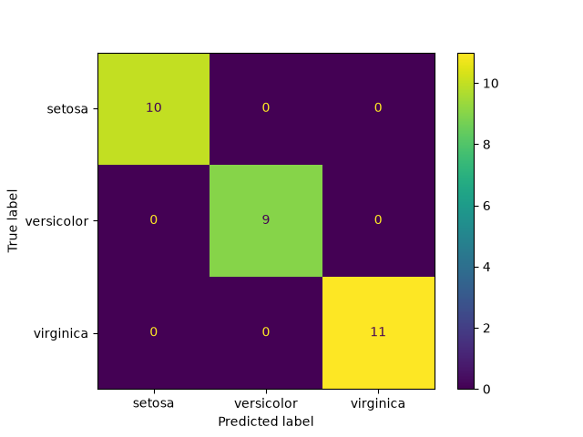

# Iris Classifier (Decision Tree)

## Overview

End-to-end machine learning example that builds a decision tree classifier on the classic Iris dataset using scikit-learn. It predicts the iris species (setosa, versicolor, virginica) from four flower measurements.

## Quick start

```bash
git clone https://github.com/mahi7903/iris-classifier.git
cd iris-classifier
python -m venv venv
venv\Scripts\activate          # Windows
# source venv/bin/activate     # macOS/Linux
pip install -r requirements.txt
python src/train.py --test-size 0.2 --random-state 42
```

The script prints the accuracy and evaluation scores, and saves the confusion matrix to `outputs/confusion_matrix.png`.

## Results

A Decision Tree was trained on 120 flowers and tested on 30 unseen flowers. It classified all 30 correctly: accuracy, precision, recall and F1 were all 1.0.



This is common for Iris because the species are easy to tell apart, especially by petal size. A different train/test split may give a slightly lower score.

## Project structure

```
iris-classifier/
├── data/               # empty, Iris is loaded from scikit-learn
├── notebooks/
│   └── iris_model.ipynb  # walk-through notebook
├── src/
│   └── train.py        # reproducible CLI script
├── tests/
│   └── test_train.py   # basic pytest
├── outputs/            # model outputs and figures
├── .gitignore
├── LICENSE
├── README.md
└── requirements.txt
```

## License

This project is licensed under the MIT License. See [LICENSE](LICENSE) for details.